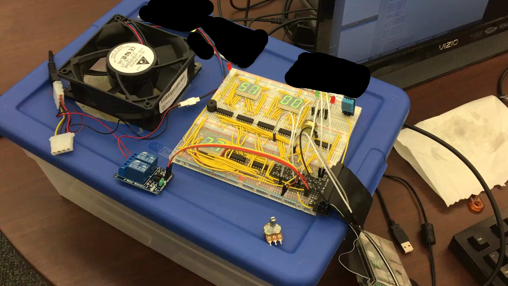

# Humidifier

This was a group project completed in 2017 for an Embedded Systems course, part of an MS-level Software Engineering degree program.

The group chose to build a humidifier using a Raspberry Pi. The C++ code in this repo is for the system's control unit. The control unit is shown in the image below.

The humidifier worked by running a fan at high speed over a large surface area of water. This would cause the water to evaporate into the air, raising the relative humidity of the air.

The fan was attached to a plastic container which held the water. A sensor would check the humidity of the air and, depending on the set point, would determine what to do with the fan (e.g. turn on, turn off, do nothing).

The fan was controlled via 5v relay, which is shown on the bottom part of the image above.

The decision to turn on or off the fan was done using a running average. Without a running average, the fan would constantly turn on and off right around when the desired humidity level and actual humidity level started to converge.

The system included a water level sensor to check and see if water was in the tank. If no water was in the tank then the fan would not turn on. This was done to save energy.

A potentiometer was used to set the desired humidity level and is read using the `analogRead` function.

The humidity was displayed to the user as they rotated the dial for the set point.

Six 7-segment displays were required for three 2-digit displays. The control unit displayed both the current temperature and humidity, and also displayed the 'set point' that was input by the user, hence the need for three separate sets of displays.

